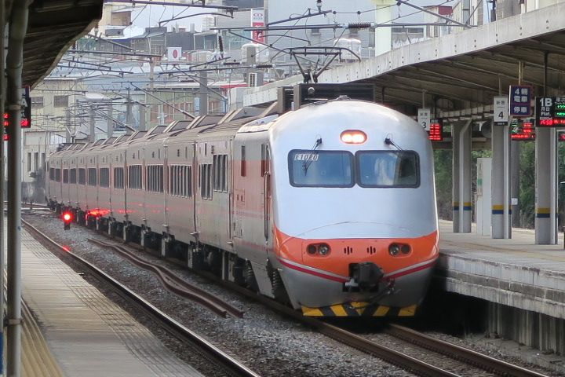
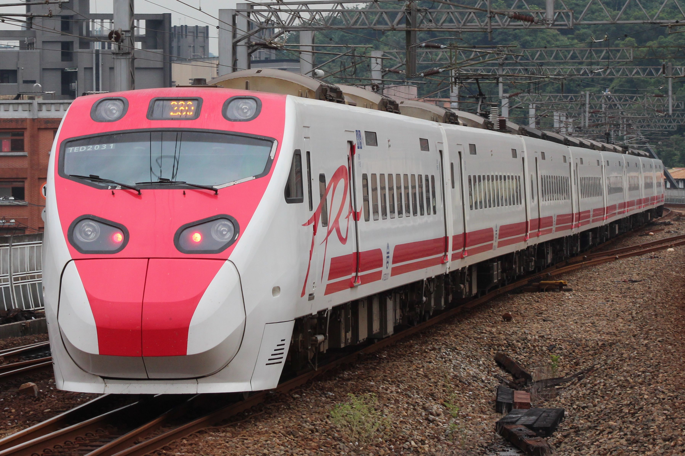
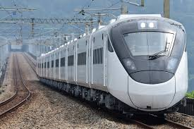
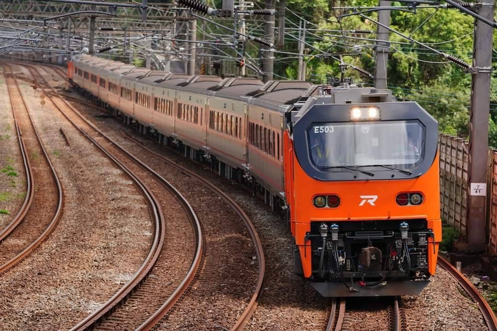
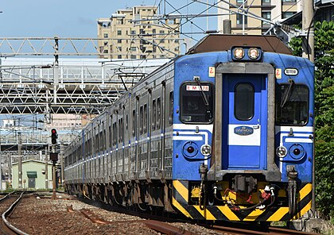
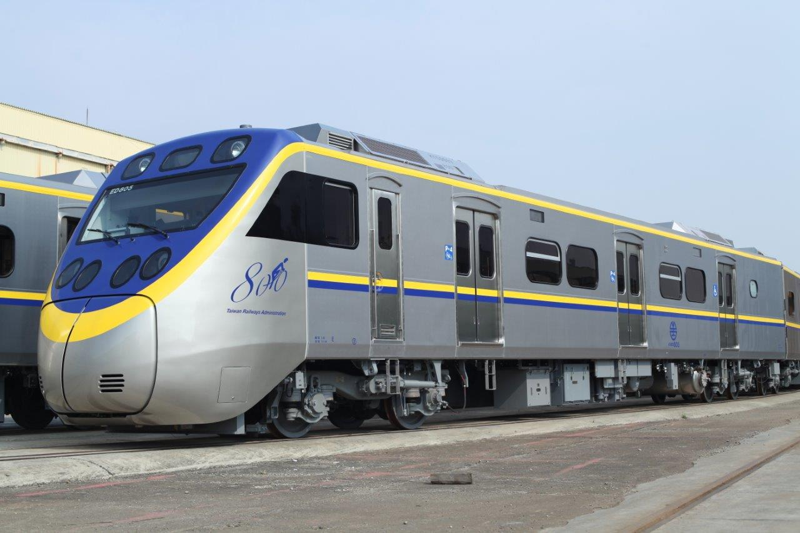
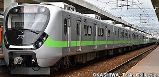

|項次|項目|內容|
|---|---|---|
| 1 | 圖片 |  |
| 2 | 姓名 | 陳冠中 |
| 3 | 任職公司 | 台鐵 |
| 4 | 工作 | 火車檢查員 |

      
觀看影片
<a href="https://www.youtube.com/watch?v=ZoNH1HJr0OQ" target="_blank">攬佬SKAI ISYOUGOD【八方來財·因果】</a> 

 影片取自 youtube

      

## 台鐵營運車種列表

|項次|項目|內容|
|---|---|---|
| 1 | 圖片 |  |
| 2 | 車名 | E1000 |
| 3 | 車種 | 自強號 |
| 4 | 特色 | PP推拉式機車 |

|項次|項目|內容|
|---|---|---|
| 1 | 圖片 |  |
| 2 | 車名 | TEMU1000 |
| 3 | 車種 | 自強號 |
| 4 | 特色 | (太魯閣)傾斜式列車 |

|項次|項目|內容|
|---|---|---|
| 1 | 圖片 |  |
| 2 | 車名 | TEMU2000 |
| 3 | 車種 | 自強號 |
| 4 | 特色 | (普悠瑪)傾斜式列車 |

|項次|項目|內容|
|---|---|---|
| 1 | 圖片 |  |
| 2 | 車名 | EMU3000 |
| 3 | 車種 | 自強號 |
| 4 | 特色 | 新車!! |

|項次|項目|內容|
|---|---|---|
| 1 | 圖片 |  |
| 2 | 車名 | E500 |
| 3 | 車種 | 自強號 |
| 4 | 特色 | 新車!! |

|項次|項目|內容|
|---|---|---|
| 1 | 圖片 |  |
| 2 | 車名 | EMU500 |
| 3 | 車種 | 區間車 |
| 4 | 特色 | 老車!! |

|項次|項目|內容|
|---|---|---|
| 1 | 圖片 |  |
| 2 | 車名 | EMU800 |
| 3 | 車種 | 區間車 |
| 4 | 特色 | 微笑號 |

|項次|項目|內容|
|---|---|---|
| 1 | 圖片 |  |
| 2 | 車名 | EMU900 |
| 3 | 車種 | 區間車 |
| 4 | 特色 | 號稱最美區間車? |

